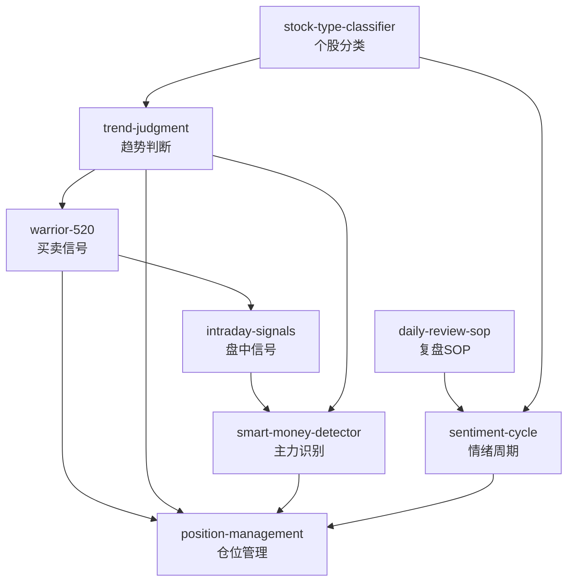

# INDEX — Mistery 交易技能体系

> 8 个 skill 总览 + 引用图。蒸馏自《Mistery趋势交易理论》+《Mistery复盘合集》

## Skill 总览

| # | Skill | 用途 | 关键输出 |
|---|-------|------|---------|
| S1 | `trend-judgment` | 判断个股/大盘趋势方向 | 上升/下降/震荡 + 置信度 + 操作建议 |
| S2 | `warrior-520` | MA5×MA20买卖信号 | 金叉买入/回踩低吸/死叉卖出 + 止损位 |
| S3 | `position-management` | 仓位配置和建仓节奏 | 5+3+2分层 + 分批建仓计划 + 风控检查 |
| S4 | `sentiment-cycle` | 判断市场情绪温度 | 六阶段定位 + 操作策略 |
| S5 | `stock-type-classifier` | 个股前置分类器 | 情绪票/趋势票 + 对应操作逻辑 |
| S6 | `smart-money-detector` | 识别主力行为意图 | 吸筹/洗盘/拉升/出货 + 操作建议 |
| S7 | `daily-review-sop` | 每日盘后复盘 | 五层模板复盘报告 + 明日计划 |
| S8 | `intraday-signals` | 盘中信号预警 | 三时间点扫描 + 红黄绿灯 |

## 推荐调用流程

### 分析个股
```
stock-type-classifier → trend-judgment → warrior-520 → position-management
    (先分类)         (判方向)       (找买卖点)     (定仓位)
```

### 盘中看盘
```
intraday-signals → smart-money-detector → position-management
  (扫描信号)        (判断主力意图)      (调仓位)
```

### 盘后复盘
```
daily-review-sop → sentiment-cycle → trend-judgment → position-management
   (五层复盘)       (情绪阶段)      (趋势确认)     (仓位计划)
```

## 引用图



## 依赖关系

- **基础层**: `trend-judgment`, `stock-type-classifier`, `sentiment-cycle` (可独立使用)
- **执行层**: `warrior-520`, `position-management`, `intraday-signals` (依赖基础层输出)
- **分析层**: `smart-money-detector`, `daily-review-sop` (整合多层信息)
